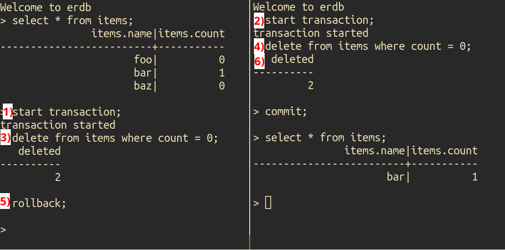

# erdb - an educational relational dbms

A relational database just for fun and learning purposes. Storage layout is Postgres inspired. Work is still very much in progress. Quite a lot of things are missing.

Transaction isolation is achieved by MVCC. READ COMMITTED and REPEATABLE READ are already implemented (READ UNCOMMITTED will never work, maybe SERIALIZABLE some day).

### Examples of READ COMMITTED transactions (default isolation level)
#### SELECT

#### DELETE

#### UPDATE

### Example of REPEATABLE READ transaction

